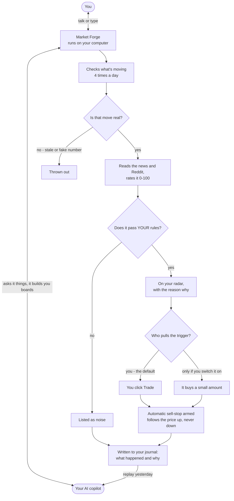

Market Forge is a **local trading desk with an AI copilot sitting next to you**.

A scanner engine hunts catalyst-driven movers and checks its own numbers against the
live tape. A dashboard shows you the desk. And a coding agent drives that desk while
you talk to it, building panels, answering questions, and replaying your trading day.

It runs on your computer. Your broker keys stay in a file on your disk. It ships in
paper mode with auto-trading switched off.

<CardGroup cols={2}>
  <Card title="Install it" icon="download" href="/marketforge/install">
    One line, or hand the job to your AI agent.
  </Card>
  <Card title="What you need" icon="list-check" href="/marketforge/requirements">
    Python, a free Alpaca account, and a few optional extras.
  </Card>
</CardGroup>

## Why it exists

It was built by a network engineer learning swing trading who kept watching the same
two mistakes happen: chasing a move that already happened, and holding a winner until
it round-tripped.

Both are discipline problems. So the discipline went into code instead of willpower.
Every entry the bot takes is capped, verified, and carries an exit before it exists.

## See it move

<video
  className="w-full aspect-video rounded-xl"
  src="https://madeformeai.com/marketforge/demo-2026-08-07.mp4"
  poster="https://madeformeai.com/marketforge/demo-poster-2026-08-07.png"
  controls
  playsInline
  preload="metadata"
/>

Two minutes, cut from one real pre-market session on a real $1,000 account. Nothing
staged, nothing re-shot.

<CardGroup cols={2}>
  <Card title="The short cut (2 min)" icon="youtube" href="https://youtu.be/3jalTccK5eg">
    Same video, on YouTube: the brief, the plan, the staged ticket, the refusal.
  </Card>
  <Card title="The whole session (6 min)" icon="youtube" href="https://youtu.be/y60QIhaU3Vk">
    Unscripted and chaptered, including the parts where the agent is just thinking.
  </Card>
</CardGroup>

## What a session actually looks like

The demo above is the honest shape of a morning, and it is worth reading before you
install anything:

<Steps>
  <Step title="You ask for the brief">
    One request, spoken or typed. The desk, the charts and the broker all get driven
    from it.
  </Step>
  <Step title="It reports state, not vibes">
    What changed since last time, which positions are protected, what the radar found,
    and what it scored. On the day this was filmed the radar had exactly one name, the
    model scored it 18, called it noise, and told him to skip.
  </Step>
  <Step title="You point it at a name">
    It pulls the chart into your own browser, then writes the read: what actually moved
    the stock, the levels that matter, and whether the name is even inside your sizing.
  </Step>
  <Step title="It writes the plan and stages the ticket">
    Zones to buy, a no-touch level, the exact order with a trailing stop, and the dollar
    risk. If the plan breaks one of your own rules it says so once, then builds it anyway
    because you asked.
  </Step>
  <Step title="You press send">
    It will not. See [the copilot](/marketforge/copilot#the-send-button-is-yours).
  </Step>
  <Step title="The exit gets armed">
    On a fill the trailing stop arms immediately. On a slow fill a watcher arms it late,
    and a sweep flags anything still unprotected. See
    [rules and risk](/marketforge/rules-and-risk#exits-and-why-trailing).
  </Step>
</Steps>

Every step above is a chapter in the
[6 minute walkthrough](https://youtu.be/y60QIhaU3Vk), if you would rather watch it than
read it.

## The flow, in plain English

Nothing trades itself unless you deliberately turn that on, and every entry gets
an exit the moment it fills. Details in [rules and risk](/marketforge/rules-and-risk).

## The three pieces

<Steps>
  <Step title="The engine">
    Pulls the day's biggest movers, re-verifies every percentage against real price
    bars and the live tape, scores each one signal-vs-noise with an LLM, and applies
    hard risk gates before anything can trade.
  </Step>
  <Step title="The dashboard">
    A single screen: account, catalyst radar, Reddit chatter, live charts, your rules,
    your journal, and a chat with the copilot. Runs at `localhost:8410`.
  </Step>
  <Step title="The copilot">
    Any coding agent (Claude Code, Codex, others) reads and writes plain files in the
    folder. That is how it builds you a live panel, remembers your trading rules, and
    reconstructs your day on request.
  </Step>
</Steps>

## What it is not

<Warning>
Market Forge is a research and education tool. It is not financial advice, not a
signal service, and not a system that trades for you unattended out of the box.
Trading involves substantial risk of loss. Live trading is off until you turn it on
yourself, and it starts hard-capped.
</Warning>

It also does not replace your broker. Alpaca stays your broker; Market Forge is the
desk you sit at. Most people keep the Alpaca window open beside it.

## Where to go next

<CardGroup cols={2}>
  <Card title="Requirements" icon="list-check" href="/marketforge/requirements">
    Exactly what to install, and what is optional.
  </Card>
  <Card title="Install" icon="terminal" href="/marketforge/install">
    Human path and AI-agent path.
  </Card>
  <Card title="Tour the desk" icon="chart-line" href="/marketforge/the-desk">
    What every tab does.
  </Card>
  <Card title="Rules and risk" icon="shield" href="/marketforge/rules-and-risk">
    The gates, and how going live works.
  </Card>
</CardGroup>

The source lives at [github.com/almnjoy/MarketForge](https://github.com/almnjoy/MarketForge)
(MIT licensed). Questions and setups: [Discord](https://discord.gg/JE8TEYZp2f).
